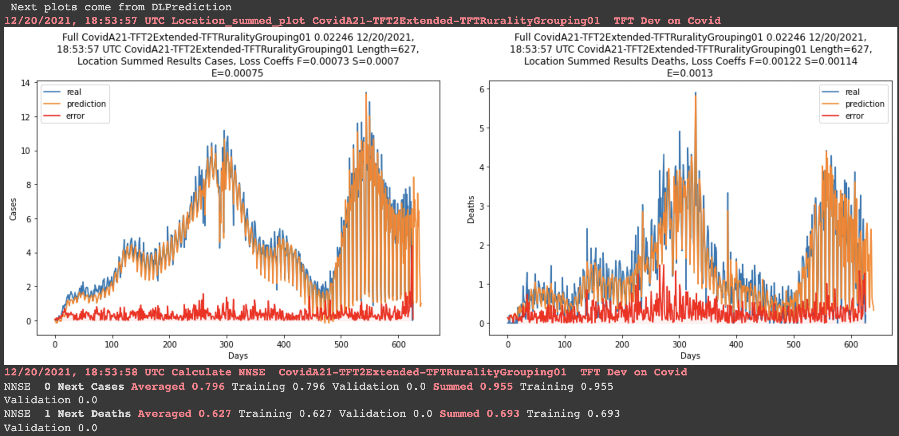
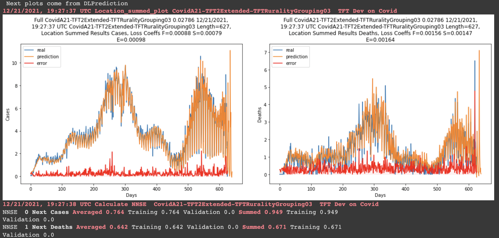

# Expedition_COVID

<b> Andrej Notes: </b>

In /code/code_andrej you can find an example of the derivative rurality notebook in rurality_derivate and an example of the the regular cases and deaths split by rurality in rurality_original

<!---

---

The strata are as follows:

{counties |  3 <= median rurality <= 5} - This gives us 702 counties.

| Median Rurality | Count Counties |
| -------------   | -------------  |
|  3.0            | 45             |
|  3.5            | 7              |
|  4.0            | 397            |
|  4.5            | 71             |
|  5.0            | 182            |
| --------------- | -------------- |
| Total           | 702            |

---
 
{counties subset | MAD < 1} - this is 434 counties

| Median Rurality | Count Counties |
| -------------   | -------------  |
|  3.0            | 9              |
|  4.0            | 307            |
|  4.5            | 43             |
|  5.0            | 75             |
| --------------- | -------------- |
| Total           | 434            |

---
 
{counties subset | 1 <= MAD < 2} - 188 counties

| Median Rurality | Count Counties |
| -------------   | -------------  |
|  3.0            | 33             |
|  3.5            | 6              |
|  4.0            | 63             |
|  4.5            | 7              |
|  5.0            | 79             |
| --------------- | -------------- |
| Total           | 188            |
 
---
 
{counties subset | 2 <= MAD < 3} - 69 counties

| Median Rurality | Count Counties |
| -------------   | -------------  |
|  3.0            | 3              |
|  3.5            | 1              |
|  4.0            | 26             |
|  4.5            | 21             |
|  5.0            | 18             |
| --------------- | -------------- |
| Total           | 69             |

---

 
<b> This one is no longer in use as the sample is too small </b>
{counties subset | 3 <= MAD < 4 } - 11 counties

I have also added differenced and derivate data to dataset_raw/

-->

<b> I am currently working on automating pdf saving in notebook code so that it is much more painless to organize all of the results.</b>

---

## Features

Most of the features are results from the [COVID-19 Pandemic Vulnerability Index (PVI) Dashboard](https://covid19pvi.niehs.nih.gov/) maintained by National Institute of Environmental Health Sciences. They have two different versions of the dashboard model (11.2 and 12.4). Since model 12.4 only has data since 2021, we have used model 11.2.

| Feature        | Type       |  Currently in Use?      |
|------------------------|------------|-------------------------|
| Age Distribution       | Static     | Yes    |
| Air Pollution    | Static     | Yes    |
| Comorbidities          | Static     | Yes    |
| Demographics    | Static     | No    |
| Health Disparities     | Static     | Yes    |
| Hospital Beds   | Static     | No    |
| Mobility   | Static     | Yes    |
| Residential Density    | Static     | Yes                     |
| Voting    | Static     | No    |
| Disease Spread         | Dynamic    | Yes     |
| Social Distancing      | Dynamic    | Yes    |
| Testing    | Dynamic    | Yes           |
| Transmission    | Dynamic    | Yes    |
| Vaccination >=1 Dose   | Dynamic    | Yes **Note filled zeros |
| Vaccination Full (2)   | Dynamic    | Yes **Note filled zeros |

<h3 class="accordion-toggle accordion-toggle-icon">Details of Features from PVI Model (11.2)</h4>

<table class="pop_up_table" summary="Datasets comprising the current PVI model">
<thead>
<tr>
<th scope="col">Data Domain (% weight)  Data Slice (% weight)   Component(s)</th>
<th colspan="2" scope="col">Update Freq.</th>
<th scope="col">Description/Rationale</th>
<th scope="col">Source(s)</th>
</tr>
<tr>
<th style="text-align: left;" colspan="5">Infection Rate (24%)</th>
</tr>
</thead>
<tbody>
<tr>
<td colspan="5"><strong>Transmissible Cases (20%)</strong></td>
</tr>
<tr>
<td></td>
<td>Daily</td>
<td style="background: #CC3333;"></td>
<td><em>Population size divided by cases from the last 14 days</em>. Because of the 14-day incubation period, the cases identified in that time period are the most likely to be transmissible. This metric is the number of such &ldquo;contagious&rdquo; individuals relative to the population, so a greater number indicates more likely continued spread of disease.</td>
<td><a href="https://usafacts.org/issues/coronavirus/" target="_blank">USA Facts</a></td>
</tr>
<tr>
<td colspan="5"><strong>Disease Spread (4%)</strong></td>
</tr>
<tr>
<td></td>
<td>Daily</td>
<td style="background: #E64D4D;"></td>
<td><em>Fraction of total cases that are from the last 14 days (one incubation period)</em>. Because COVID-19 is thought to have an incubation period of about 14 days, only a sustained decline in new infections over 2 weeks is sufficient to signal reduction in disease spread. This metric is always between 0 and 1, with values near 1 during exponential growth phase, and declining linearly to zero over 14 days if there are no new infections.</td>
<td><a href="https://usafacts.org/issues/coronavirus/" target="_blank">USA Facts</a></td>
</tr>
<tr>
<th style="text-align: left;" colspan="5">Population Concentration (16%)</th>
</tr>
<tr>
<td colspan="5"><strong>Population Mobility (8%)</strong></td>
</tr>
<tr>
<td>Daytime Population Density</td>
<td>Static</td>
<td style="background: #57B757;"></td>
<td><em>Estimated daytime population</em>. Greater daytime population density is expected to increase the spread of infection because more people are in closer proximity to each other.</td>
<td>The field &ldquo;DPOPDENSCY&rdquo; (<a href="https://www.arcgis.com/home/item.html?id=6d1d1b9965f9455c86519ca5be9a0cbb" target="_blank">2019 Daytime Pop Density</a>) from ESRI demographics analysis of American Community Survey data  <a href="https://svi.cdc.gov/data-and-tools-download.html" target="_blank">2018 CDC Social Vulnerability Index</a> (adjunct variable)</td>
</tr>
<tr>
<td>Baseline Traffic</td>
<td>Static</td>
<td style="background: #57B757;"></td>
<td><em>Average traffic volume per meter of major roadways in the county from 2018 EPA EJSCREEN</em>. Greater traffic volume is expected to increase the spread of infection due to more people moving and interaction.</td>
<td><a href="https://www.countyhealthrankings.org" target="_blank">2020 County Health Rankings</a></td>
</tr>
<tr>
<td colspan="5"><strong>Residential Density (8%)</strong></td>
</tr>
<tr>
<td>Residential Density</td>
<td>Static</td>
<td style="background: #5CED5C;"></td>
<td><em>Integrates data from the 2014-2018 ACS on families in multi-unit structures, mobile homes, over-crowding (more people than rooms), being without a vehicle, and persons in institutionalized group quarters</em>. All of these variables are associated with greater residential density, which is expected to increase the spread of infection because more people are in closer proximity to each other.</td>
<td><a href="https://svi.cdc.gov/data-and-tools-download.html" target="_blank">2018 CDC Social Vulnerability Index</a> (SVI Housing Type &amp; Transportation Theme)</td>
</tr>
<tr>
<th style="text-align: left;" colspan="5">Intervention Measures (16%)</th>
</tr>
<tr>
<td colspan="5"><strong>Social Distancing (8%)</strong></td>
</tr>
<tr>
<td></td>
<td>Daily</td>
<td style="background: #4258C9;"></td>
<td><em>Unacast social distancing scoreboard grade is assigned by looking at the change in overall distance travelled and the change in nonessential visits relative to baseline (previous year), based on cell phone mobility data</em>. The grade is converted to a numerical score, with higher values being less social distancing (worse score) is expected to increase the spread of infection because more people are interacting with other.</td>
<td><a href="https://www.unacast.com/covid19/social-distancing-scoreboard" target="_blank">Unacast</a></td>
</tr>
<tr>
<td colspan="5"><strong>Testing (8%)</strong></td>
</tr>
<tr>
<td></td>
<td>Daily</td>
<td style="background: #6079F7;"></td>
<td><em>Population divided by tests performed (currently only state-wide statistics are available)</em>. This is the inverse of the tests per population, so greater numbers indicate less testing. Lower testing rates mean it is more likely that infections are undetected, so would be expected to increase the spread of infection.</td>
<td><a href="https://covidtracking.com/" target="_blank">The COVID tracking project</a></td>
</tr>
<tr>
<th style="text-align: left;" colspan="5">Health &amp; Environment (44%)</th>
</tr>
<tr>
<td colspan="5"><strong>Population Demographics (8%)</strong></td>
</tr>
<tr>
<td>% Black</td>
<td>Static</td>
<td style="background: #6B0B9E;"></td>
<td><em>Percentage of population who self-identify as Black or African American.</em></td>
<td><a href="https://www.countyhealthrankings.org/explore-health-rankings/measures-data-sources/2020-measures" target="_blank">2018 Census Population Estimates</a> from CHR (County Health Rankings and Roadmaps)</td>
</tr>
<tr>
<td>% Native</td>
<td>Static</td>
<td style="background: #6B0B9E;"></td>
<td><em>Percentage of population who self-identify as American Indian or Alaska Native.</em></td>
<td><a href="https://www.countyhealthrankings.org/explore-health-rankings/measures-data-sources/2020-measures" target="_blank">2018 Census Population Estimates</a> from CHR (County Health Rankings and Roadmaps)</td>
</tr>
<tr>
<td colspan="5"><strong>Air Pollution (8%)</strong></td>
</tr>
<tr>
<td></td>
<td>Static</td>
<td style="background: #8E26C4;"></td>
<td><em>Average daily density of fine particulate matter in micrograms per cubic meter (PM2.5) from 2014 Environmental Public Health Tracking Network</em>. Air pollution has been associated with more severe outcomes from COVID-19 infection.</td>
<td><a href="https://www.countyhealthrankings.org/explore-health-rankings/measures-data-sources/county-health-rankings-model/health-factors/physical-environment/air-water-quality/air-pollution-particulate-matter" target="_blank">Air Pollution-Particulate Matter</a></td>
</tr>
<tr>
<td colspan="5"><strong>Age Distribution (8%)</strong></td>
</tr>
<tr>
<td>% age 65 and over</td>
<td>Static</td>
<td style="background: #9A42C8;"></td>
<td><em>Aged 65 or Older from 2014-2018 ACS</em>. Older ages have been associated with more severe outcomes from COVID-19 infection.</td>
<td><a href="https://svi.cdc.gov/data-and-tools-download.html" target="_blank">2018 CDC Social Vulnerability Index</a></td>
</tr>
<tr>
<td colspan="5"><strong>Co-morbidities (8%)</strong></td>
</tr>
<tr>
<td>Premature death</td>
<td>Static</td>
<td style="background: #B460E0;"></td>
<td><em>Years of potential life lost before age 75 per 100,000 population (age-adjusted) based on 2016-2018 National Center for Health Statistics - Mortality Files</em>. This is a broad measure of health, and a proxy for cardiovascular and pulmonary diseases that have been associated with more severe outcomes from COVID-19 infection.</td>
<td><a href="https://www.countyhealthrankings.org" target="_blank">2020 County Health Rankings</a></td>
</tr>
<tr>
<td>Smoking</td>
<td>Static</td>
<td style="background: #B460E0;"></td>
<td><em>Percentage of adults who are current smokers from 2017 Behavioral Risk Factor Surveillance System</em>. Smoking has been associated with more severe outcomes from COVID-19 infection, and also causes cardiovascular and pulmonary disease.</td>
<td><a href="https://www.countyhealthrankings.org" target="_blank">2020 County Health Rankings</a></td>
</tr>
<tr>
<td>Diabetes</td>
<td>Static</td>
<td style="background: #B460E0;"></td>
<td><em>Percentage of adults aged 20 and above with diagnosed diabetes from 2016 United States Diabetes Surveillance System</em>. Diabetes has been associated with more severe outcomes from COVID-19 infection.</td>
<td><a href="https://www.countyhealthrankings.org" target="_blank">2020 County Health Rankings</a></td>
</tr>
<tr>
<td>Obesity</td>
<td>Static</td>
<td style="background: #B460E0;"></td>
<td><em>Percentage of the adult population (age 20 and older) that reports a body mass index (BMI) greater than or equal to 30 kg/m2</em>. Obesity has been associated with more severe outcomes from COVID-19 infection.</td>
<td><a href="https://www.countyhealthrankings.org" target="_blank">2020 County Health Rankings</a></td>
</tr>
<tr>
<td colspan="5"><strong>Health Disparities (8%)</strong></td>
</tr>
<tr>
<td>Uninsured</td>
<td>Static</td>
<td style="background: #C885EC;"></td>
<td><em>Percentage uninsured in the total civilian noninstitutionalized population estimate, 2014- 2018 ACS</em>. Individuals without insurance are more likely to be undercounted in infection statistics, and may have more severe outcomes due to lack of treatment.</td>
<td><a href="https://svi.cdc.gov/data-and-tools-download.html" target="_blank">2018 CDC Social Vulnerability Index</a></td>
</tr>
<tr>
<td>SVI Socioeconomic Status</td>
<td>Static</td>
<td style="background: #C885EC;"></td>
<td><em>Integrates data from 2014-2018 ACS on percent below poverty, percent unemployed (historical), income, and percent without a high school diploma</em>. Lower SES are more likely to be undercounted in infection statistics, and may have more severe outcomes due to lack of treatment.</td>
<td><a href="https://svi.cdc.gov/data-and-tools-download.html" target="_blank">2018 CDC Social Vulnerability Index</a> (SVI Socioeconomic Status score)</td>
</tr>
<tr>
<td colspan="5"><strong>Hospital Beds (4%)</strong></td>
</tr>
<tr>
<td></td>
<td>Static</td>
<td style="background: #DEB9F1;"></td>
<td><em>Summation of hospital beds for hospitals with &ldquo;OPEN&rdquo; status and &ldquo;GENERAL MEDIAL AND SURGICAL&rdquo; description.</em></td>
<td><a href="https://hifld-geoplatform.opendata.arcgis.com/" target="_blank">Homeland Infrastructure Foundation-Level Data</a> (HIFLD)</td>
</tr>
</tbody>
</table>

## Current Modeling Results

### Stratum Definitions

1. MADgroup [1,2) with 3.5 < MedianRUCA <= 4.5
2. MADgroup [1,2) with MedianRUCA > 4.5
3. MADgroup [2,3) with MedianRUCA > 3.5

### Result Table

| Stratum | Size (Counties)|Overall Results Snapshot       | Link to Notebook   |
|---------|----------------|----------------------------------------|--------------------|
|   1     |       70       | |      [Link](code/code_andrej/rurality_december_strata/CovidA21_TFTExtendedDates_Rurality_Rur3_5_4_5_MAD1_2.ipynb)        |
|   2     |       79       | |      [Link](code/code_andrej/rurality_december_strata/CovidA21_TFTExtendedDates_Rurality_MED4_5_MAD1_2.ipynb )           |
|   3     |       65       | |      [Link](code/code_andrej/rurality_decemver_strata/CovidA21_TFTExtendedDates_Rurality_Rur3_5_5_MAD2_3.ipynb)          |
