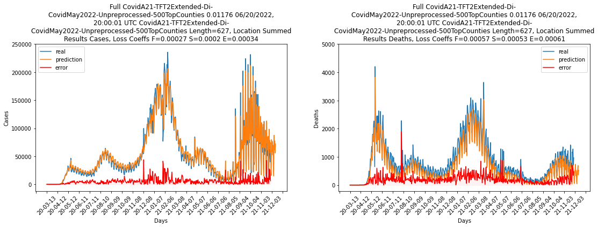

# TFT1 v1 Beta Release
Demo video: https://drive.google.com/file/d/19GMd8ogj6zW2I9gPHzdGWnPHGgg4YIAg/view?usp=sharing


## Data
There are two datasets in provided. **CovidDecemeber12-2021** and **CovidMay17-2022**. Features used in the datasets are listed below.

## Features
| Feature        | Type       |  Currently in Use?      |
|------------------------|------------|-------------------------|
| **Age Distribution**    | Static     | **Yes**    |
| Air Pollution    | Static     | No    |
| Comorbidities          | Static     | No    |
| Demographics    | Static     | No    |
| **Health Disparities**    | Static     | **Yes**    |
| Hospital Beds   | Static     | No    |
| Mobility   | Static     | No    |
| Residential Density    | Static     | No                     |
| Voting    | Static     | No    |
| **Disease Spread**       | Dynamic    | **Yes**     |
| **Social Distancing**    | Dynamic    | **Yes**    |
| Testing    | Dynamic    | No           |
| **Transmission**    | Dynamic    | **Yes**    |
| Vaccination >=1 Dose   | Dynamic    | No |
| **Vaccination Full**  | Dynamic    | **Yes** |

## Temporal Fusion Transformer v1
**TFT1_v1_Train.ipynb:** minimal TFT1 notebook which only supports model training and inferencing \
**TFT1_v1_Morris_PCA.ipynb:** TFT1 + Sensitivity Analysis (Morris and PCA)
**tft1_v1_train_script.py:** Python script version of **TFT1_v1_Train.ipynb**. Works on Rivanna.

### Notebook Setup
```
COLABROOTDIR
│   TFT1_v1.ipynb   
│
└───COVIDJuly2020
│   │
|   └───checkpoints
│   └───CovidDecember12-2021 (data folder)
│       │   Age Distribution.csv
│       │   Air Pollution.csv
│       │   ...
│   
└───GPCE
    │   
    └───TFToriginal
        │   ...
```

The file structure is shown above. The notebook can be setup with the following steps:

1. Organize the files with the structure shown above. The COLABROOTDIR is the root dir of the notebook. The GPCE folder contains the code of TFT model and is the place where TFT1 saves checkpoints and tmp data.
2. In the 'Setup File Systems' code block, change COLABROOTDIR to your root dir of the notebook.
```
COLABROOTDIR="/content/drive/MyDrive/UVA_Research/COVID_Research
```
3. In the 'Start Training' code block, change the directory here to your directory of GPCE/TFToriginal/.
```
%cd "/content/drive/MyDrive/UVA_Research/COVID_Research/GPCE/TFToriginal/"
```
4. Set up 'RunName' and the dataset to use in the 'Set up RunName and Dataset Directory' code block. 'DATASET_NAME' can be set to 'CovidDecember12-2021' or 'CovidMay17-2022'.
```
RunName = 'CovidA21-TFT2Extended-Di-NewData-Unpreprocessed-500TopCounties'
DATASET_NAME = 'CovidMay17-2022'
```
5. Feature selection settings are in 'Science Data Arrays' code block. To use a feature, set the boolean value to True.
```
AgeDist = (True, ['Age Distribution.csv'])
```
6. To train the model, set TFTMode to 1. To do inferencing, set TFTMode to 0.
```
TFTMode = 1
```

## Experiment Setups
### Training Parameters
```
# dropout_rate = 0.2
# hidden_layer_size = 64
# learning_rate = 0.001
# minibatch_size = 64
# max_gradient_norm = 0.01
# num_heads = 4
# stack_size = 1
# total_time_steps = 28
# num_encoder_steps = 13
# num_epochs = 60
# early_stopping_patience = 60
# multiprocessing_workers = 5
# input_size = 8
# output_size = 2
# category_counts = []
# input_obs_loc = [1, 2]
# static_input_loc = [3]
# known_regular_inputs = [3, 5, 6, 7]
# known_categorical_inputs = []
# quantiles = [1.0]
# quantilenames = ['MSE']
# quantileindex = 0
# TFTLSTMFinalMLP = 128
# TFTOption1 = 1
# TFTOption2 = 0
# TFTMultivariate = True
# TFTFinalGatingOption = 1
# TFTSymbolicWindows = False
```

### Feature Selections
 Selection Name | Features |
|---------|----------------|
|   Poster     |       Age Distribution, Health Disparities, Disease Spread, Social Distancing, Transmissible Cases, Vaccination, Linear Space, CosWeekly, SinWeekly       |
|   Vaccine vs Cases     |       Age Distribution, Vaccination, Linear Space, CosWeekly, SinWeekly       |  


## Ground Truth and Sample Prediction Results
### Ground Truth


### Sample Prediction Results
| Data | Size (Counties)| Features |        Overall Results Snapshot       | 
|---------|----------------|----|-------------------------------------------------------|
|   COVIDMay17-2022-Preprocessed     |       500       | Poster |  |
|   COVIDMay17-2022-Unpreprocessed     |       500       | Poster |  |
|   COVIDMay17-2022 | 500 | Vaccine vs Cases |  |        