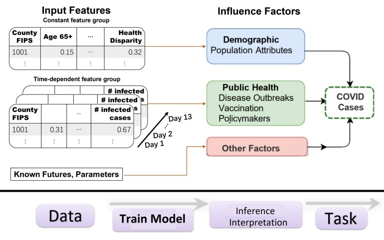

# Input Data and Features
```{note}
Past values of target and known futures are also used as observed inputs by TFT.
```

## Design


<div align="center">

| Feature | Type |  Description/Rationale | Source(s) |
|:---:|:---:|:---|:---:|
|Age Distribution| Static | <em>Aged 65 or Older from 2016-2020 American Community Survey (ACS)</em>. Older ages have been associated with more severe outcomes from COVID-19 infection. | {cite:t}`svi2020`|
|Health Disparities |Static|<em>Percentage uninsured in the total civilian noninstitutionalized population estimate, 2016- 2020 ACS</em>. Individuals without insurance are more likely to be undercounted in infection statistics, and may have more severe outcomes due to lack of treatment. |{cite:t}`svi2020`|
|Transmissible Cases|Observed|<em>Cases from the last 14 days per 100k population</em>. Because of the 14-day incubation period, the cases identified in that time period are the most likely to be transmissible. This metric is the number of such "contagious" individuals relative to the population, so a greater number indicates more likely continued spread of disease.| {cite:t}`usafacts,svi2020`|
|Disease Spread|Observed|<em>Cases that are from the last 14 days (one incubation period) divided by cases from the last 28 days </em>. Because COVID-19 is thought to have an incubation period of about 14 days, only a sustained decline in new infections over 2 weeks is sufficient to signal reduction in disease spread. This metric is always between 0 and 1, with values near 1 during exponential growth phase, and declining linearly to zero over 14 days if there are no new infections.|{cite:t}`usafacts`|
|Social Distancing|Observed|<em>Unacast social distancing scoreboard grade is assigned by looking at the change in overall distance travelled and the change in nonessential visits relative to baseline (previous year), based on cell phone mobility data</em>. The grade is converted to a numerical score, with higher values being less social distancing (worse score) is expected to increase the spread of infection because more people are interacting with other.|{cite:t}`unacast`|
|Vaccination|Observed|Percent of people who are fully vaccinated (have second dose of a two-dose vaccine or one dose of a single-dose vaccine) based on the jurisdiction and county where recipient lives.|{cite:t}`vaccination`|
|SinWeekly|Known Future|<em>Sin (day of the week / 7) </em>|Date|
|CosWeekly|Known Future|<em>Cos (day of the week / 7) </em>|Date|
| Case | Target | COVID-19 infection at county level | {cite:t}`usafacts` |
</div>

